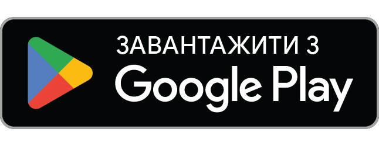
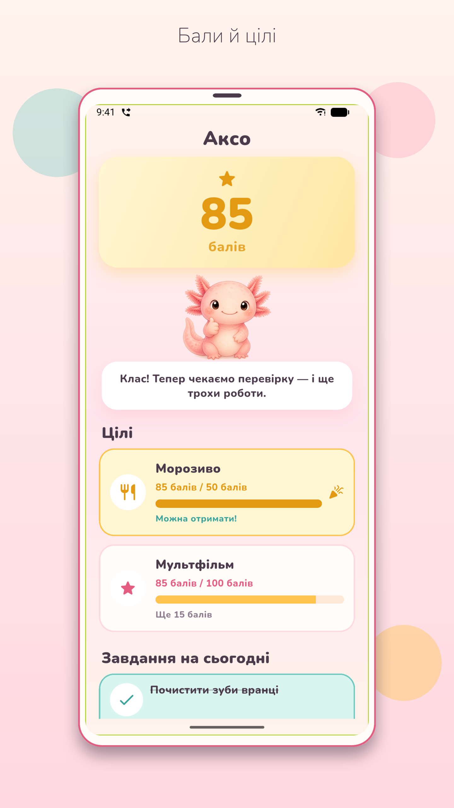
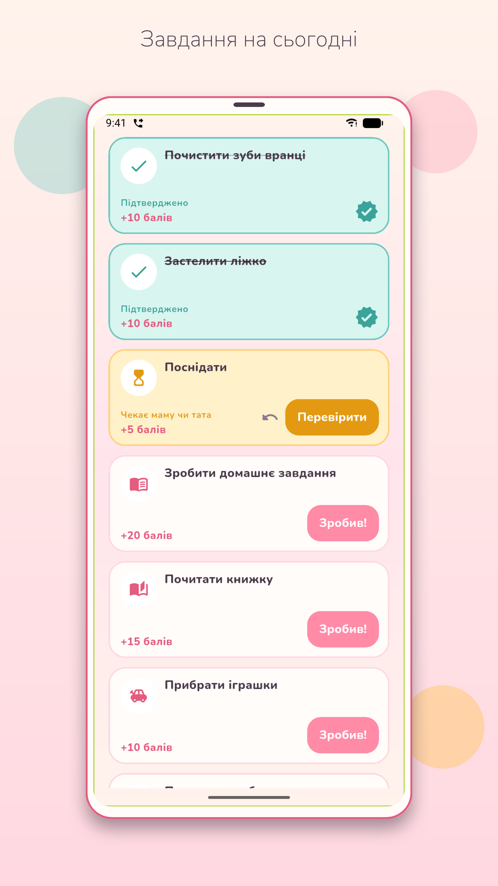
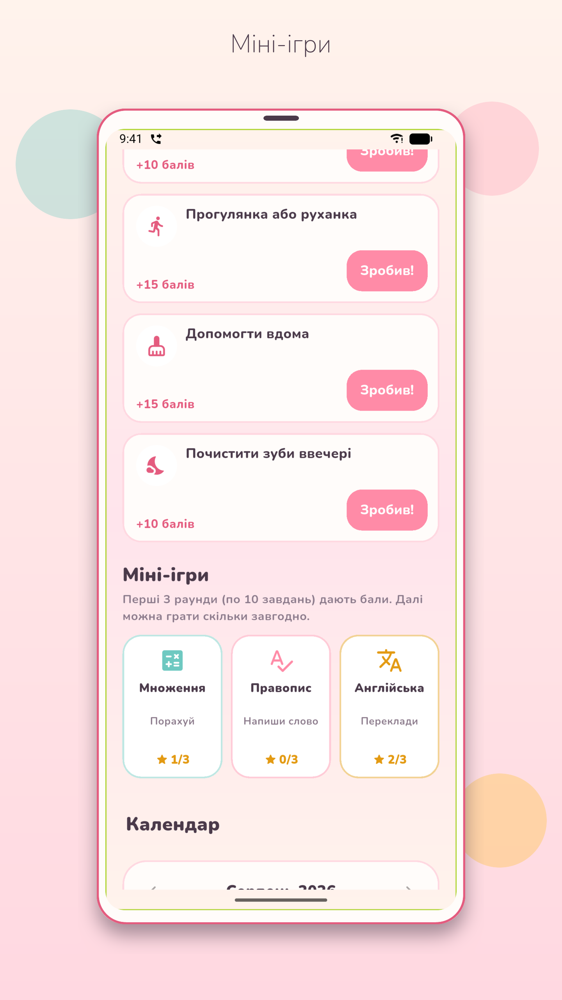
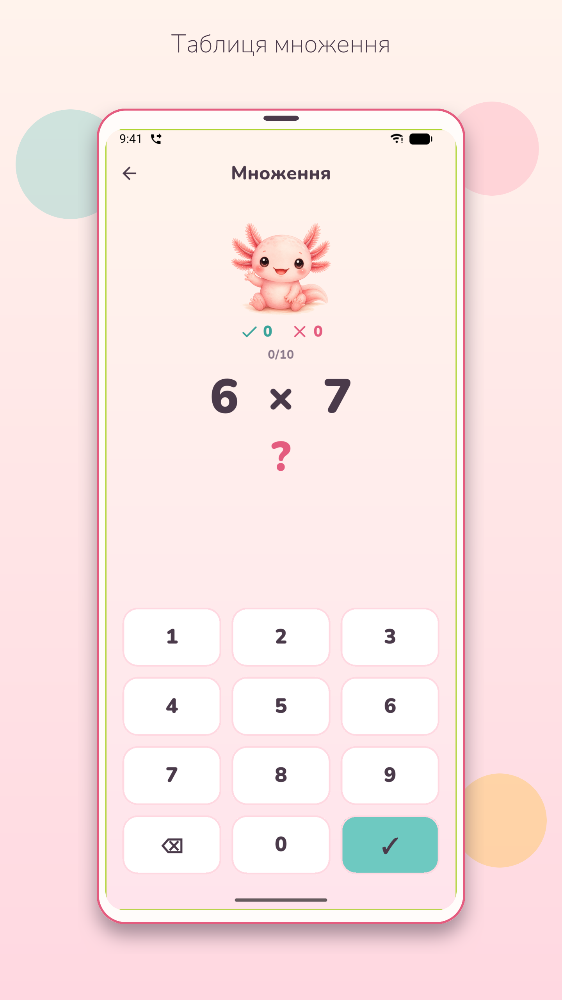
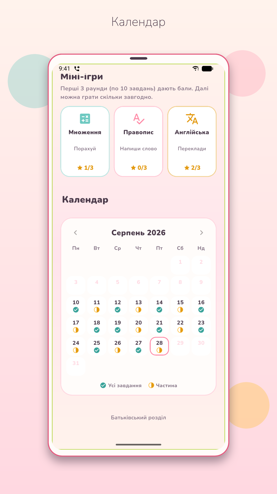
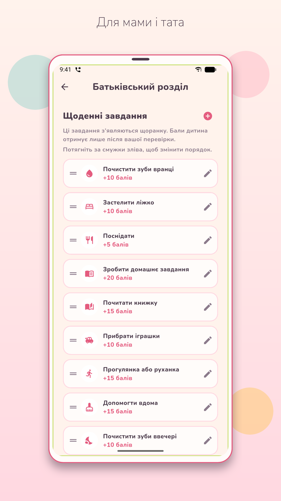

# Аксо

Трекер звичок для дітей: завдання, бали, цілі й ігри з аксолотлем Аксо.

  
  
  

Аксо — рожевий аксолотль, який допомагає дітям виконувати щоденні справи.

Дитина робить завдання й натискає «Зробив!». Мама чи тато підтверджують паролем — і з’являються бали. Бали можна витратити на цілі: солодощі, мультфільм, спільну гру — що оберете разом.

  
  
  

  
  
  

## Для дитини

- Завдання на сьогодні — щоденні й разові
- Бали за підтверджені справи
- Цілі, до яких приємно йти
- Календар: видно, як ішов тиждень
- Міні-ігри з балами: таблиця множення, український правопис, англійська

## Для мами і тата

- Пароль захищає налаштування
- Ви складаєте список щоденних завдань і їхню вартість у балах
- Підтверджуєте виконане або повертаєте на доопрацювання
- Можна нарахувати бонус або зняти бали
- Коли дитина назбирала на ціль — ви її видаєте

## Міні-ігри

У кожній грі 10 завдань у раунді. Перші 3 раунди на день дають бали, далі можна тренуватися скільки завгодно.

- **Множення** — легко, нормально або складно
- **Правопис** — напиши слово українською
- **Англійська** — переклад в один бік або в обидва

## Приватність

Усі дані лишаються на телефоні. Без акаунтів, без реклами і без збору даних.

Повна політика: [docs/privacy.md](docs/privacy.md)

---

# Axo

Family habit tracker: tasks, points, and games with Axo the axolotl.

Axo is a pink axolotl who helps kids get through the day’s tasks.

The child does a task and taps Done. A parent confirms with a password — and points appear. Points can be spent on goals you choose together: a treat, a cartoon, extra playtime.

## For kids

- Today’s tasks — daily and one-off
- Points for verified tasks
- Goals worth saving up for
- A calendar of how the week went
- Mini-games that earn points: times tables, Ukrainian spelling, English

## For parents

- A password protects settings
- You set the daily task list and how many points each is worth
- Confirm a task or send it back
- Add a bonus or take points away
- When a goal is reached, you mark it as given

## Mini-games

Each game is 10 questions per round. The first 3 rounds per day earn points; after that, practice as much as you like.

- **Times tables** — easy, normal, or hard
- **Spelling** — write the Ukrainian word
- **English** — translate one way or both ways

## Privacy

Everything stays on the phone. No accounts, no ads, and no data collection.

Full policy: [docs/privacy.md](docs/privacy.md)
